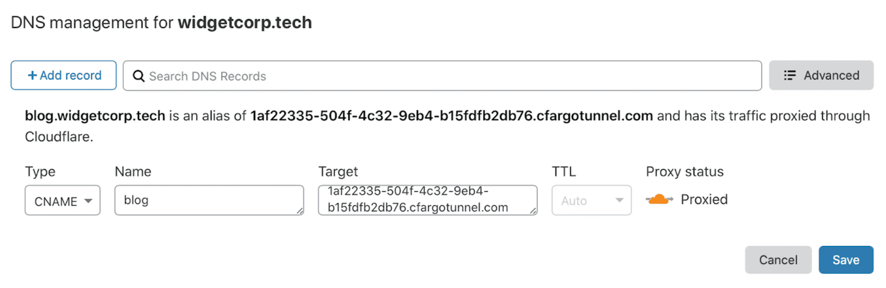

# Hassio Custom Addon: CloudFlare Argo

Setup Cloudflare Argo containers with ease!  
![Project Stage][project-stage-shield]
[![License][license-shield]](LICENSE.md)

![Supports aarch64 Architecture][aarch64-shield]
![Supports amd64 Architecture][amd64-shield]
![Supports armhf Architecture][armhf-shield]
![Supports armv7 Architecture][armv7-shield]
![Supports i386 Architecture][i386-shield]

## About

This is a very simple setup of Cloudflare argo that helps people access their Home Assistant and other HassOS addons via a public URL.

Cloudflare Argo uses a tunnel and therefore bypasses any need for a NAT'd public IP (LTE connections) or opening firewall ports etc.

I created the addon as an alternative to Nabu Casa (You should subscribe to them anyway as it funds Home Assistant Development) as I dont like using anything I cant control myself. I believe they use a reverse proxy for their setup.

## Overview

Cloudflare considers tunnels created using 1.x versions of this add-on "legacy" tunnels. Version 2.x+ uses the updated configuration method which is slightly more involved. The biggest difference is that new Argo tunnels generate a \<uuid\>.cfargotunnel.com entry in Cloudflare's internal network and you will need to point a CNAME DNS entry at it. "Legacy" Cloudflare Argo tunnels did this all in one step.

## Setup

Prerequisites:“File Editor” add-on.

1. Install the Cloudflare Argo add-on but do not start it.

2. Install cloudflared on your local machine. https://developers.cloudflare.com/cloudflare-one/connections/connect-apps/install-and-setup/installation

3. Authenticate your local cloudflared instance by running: 

    cloudflared tunnel login

4. Copy the generated cert.pem file from ~/.cloudflared/cert.pem to your hassio instance at */config/cert/argo.pem*

5. Configure the add-on
    * certificate
        * Leave as default if certificate located at /config/cert/argo.pem
    * tunnel_name (default: "homeassistant")
        * The internal Cloudflare identifier for your tunnel. It will not be publicly visible.
        * The name *MUST* be unique for your Cloudflare account. 
        * The name *CAN* be the same as the subdomain you want to use if you want to more easily idenntify this tunnel later.
        * To ensure the tunnel doesn't already exist run: 
             
            cloudflared tunnel list
        
            If it exists and you want to recreate it run 
            
            cloudflared tunnel delete \<tunnel_name\>

    * hostname
        * Enter the the FQDN of the Argo tunnel you are trying to create. Example:

            homeassistant.example.com

        * Notes:
            * This must exactly match the domain you are creating.
            * It cannot be more than one subdomain deep. h.example.com is fine. h.a.example.com is not.

    * service (default: "http://hassio:8123")    
        * The location of your hassio web interface.
        * NOTE: Works best if changed to an IP. Name based resolution from add-ons can be flaky. If you get bad gateway errors after installing change this to the static IP of your installation instead of the hostname
        * *CANNOT* end in a "/"
    
    * hostname[2|3] and service[2|3]
        * Advanced use. Leave empty for basic Cloudflare Argo installations.
        * Allows making the tunnel available at multiple subdomains
        * Can point to separate services. (For example, SSH)
    
    * addconfig
        * Advanced use. Leave empty for basic Cloudflare Argo installations.
        * Takes a path and appends its contents to the internal tunnel config.yml file.

6. Start the add-on.

7. After a minute run "cloudflared tunnel list" on your local machine. If you see the tunnel you created...  Success! (But not quite finished)

8. If your tunnel isn't being created check the add-on log for potential problems. If you see messages about the tunnel already existing you'll need to delete your cf-argo directory, run "cloudflared tunnel delete \<tunnel_name\>" and restart the service.

9. Copy the tunnelID UUID. It is in the log file at 

    "Starting tunnel tunnelID=xxxxxxxxxxx"
    
    or 

    Copy it from the "cloudflared tunnel list" output

10. Create a CNAME for your domain that points to \<UUID\>.cfargotunnel.com

    

    * This CNAME must exactly match the hostname you configure.
    * The \<UUID\>.cfargotunnel.com is not directly routable from the internet, it is only reachable through Cloudflare's internal network through this CNAME.

## Re-configuration and troubleshooting

To make configuration changes:
* Stop the service
* Delete the /config/cf-argo directory
* Start again from Step 5

<https://github.com/hassio-addons/repository>

[aarch64-shield]: https://img.shields.io/badge/aarch64-yes-green.svg
[amd64-shield]: https://img.shields.io/badge/amd64-yes-green.svg
[armhf-shield]: https://img.shields.io/badge/armhf-yes-green.svg
[armv7-shield]: https://img.shields.io/badge/armv7-yes-green.svg
[commits]: https://github.com/wlatic/hassio.addons/addon-cloudflare-argo/commits/master
[contributors]: https://github.com/wlatic/hassio.addons/addon-cloudflare-argo/graphs/contributors
[forum-shield]: https://img.shields.io/badge/community-forum-brightgreen.svg
[frenck]: https://github.com/wlatic
[gitlabci]: https://gitlab.com/wlatic/hassio.addons/addon-cloudflare-argo/pipelines
[home-assistant]: https://home-assistant.io
[i386-shield]: https://img.shields.io/badge/i386-yes-green.svg
[issue]: https://github.com/wlatic/hassio.addons/addon-cloudflare-argo/issues
[keepchangelog]: http://keepachangelog.com/en/1.0.0/
[license-shield]: https://img.shields.io/github/license/hassio-addons/addon-vscode.svg
[maintenance-shield]: https://img.shields.io/maintenance/yes/2020.svg
[project-stage-shield]: https://img.shields.io/badge/Project%20Stage-Development-yellowgreen.svg
[reddit]: https://reddit.com/r/homeassistant
[releases]: https://github.com/wlatic/hassio.addons/addon-cloudflare-argo/releases
[repository]: https://github.com/wlatic/hassio.addons/repository
[semver]: http://semver.org/spec/v2.0.0.htm
[ubuntu-packages]: https://packages.ubuntu.com
